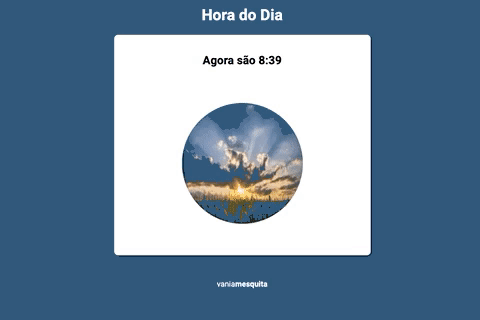

# Exercício Javascript #02
Projeto prático para o estudo e treino de Javascript

### 
 [Sobre](#sobre) | [Layout](#layout) | [Tecnologias Estudadas](#tecnologias-estudadas) 

  

## Sobre 

Esse é um site que retorna a hora atual, e que funciona da seguinte forma: utilizando javascript, o site verifica a hora atual e retorna com uma foto personalizada, alterando também o background do site.

#### Acesse o site completo: <a href="https://vaniamesquita.me/hora-do-dia/" target="_blank">vaniamesquita.me/hora-do-dia</a> 

---

## Layout

Você pode acessar o projeto clicando <a href="https://vaniamesquita.me/hora-do-dia/" target="_blank">aqui</a>

<table align="center">
   <tr>
    <td valign="top"> </td>
    
   </tr>
 </table>
  

## Tecnologias Estudadas

1. **HTML5**
2. **CSS3**
3. **Javascript** : funções, variáveis, condicionais e manipulação do dom usando os métodos: 
   
   - [x] *data.getHours()*
   - [x] *data.getMinutes()*
   - [x] *document.getElementById*
   - [x] *msg.innerHTML*

---

## 👩🏻‍💻 Autora

<a href="https://github.com/vaniamesquita"> 
  
 Feito com :blue_heart: por <b>Vania Mesquita</b></a>  

 

  

